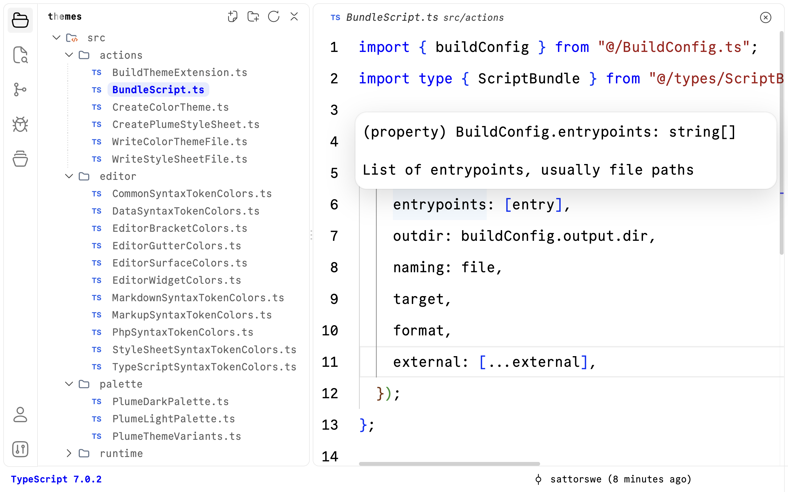

# Plume Icons

A clean, rounded product icon theme for VS Code, built from [Hugeicons](https://hugeicons.com).

Plume replaces the icons in the VS Code interface itself: the activity bar, toolbars, notifications, tree arrows, close buttons, and status indicators. It does not change file icons in the Explorer.

This extension is not published to the VS Code Marketplace. You download it from [GitHub Releases](https://github.com/sattorswe/plume-icons/releases) and install it with one command.

## Screenshots

The activity bar on the left, the Explorer toolbar, and the close button in the editor header all use Plume Icons. The colors come from the matching [Plume Themes](https://github.com/sattorswe/plume-themes).

| Light | Dark |
| --- | --- |
|  |  |

## What it changes

| Area | Icons |
| --- | --- |
| Activity bar | Explorer, Search, Source Control, Run and Debug, Extensions, Accounts, Manage |
| Navigation | Chevrons, arrows, small arrows, circled arrows |
| Notifications | Bell, unread bell, Do Not Disturb |
| Status | Verified, warning, error, info, passed, check |
| Actions | Close, clear, delete, settings, search, add, more, refresh, filter, new file, new folder, collapse, expand, copy, edit, pin, open external, show, hide, lock, Git branch, split editor |
| Debug toolbar | Start, continue, pause, stop, disconnect, restart, step over, step into, step out, step back, reverse continue, run |
| Panel and terminal | Terminal, new terminal, kill terminal, rename, profiles, Output, Problems, Debug Console, Ports, maximize, restore, close |
| Source Control | Discard, unstage, open file, commit, fetch, pull, push, sync, stash, pull request, compare changes, tree and list view |

Anything not listed keeps the default VS Code icon.

## Requirements

- **VS Code** 1.139 or newer
- **The `code` command** in your terminal. In VS Code, open the Command Palette (`Cmd+Shift+P`) and run **Shell Command: Install 'code' command in PATH**.

## Install

**1. Install the extension**

Download the latest release and install it into VS Code:

```bash
curl -fLO https://github.com/sattorswe/plume-icons/releases/latest/download/plume-icons.vsix
code --install-extension plume-icons.vsix
rm plume-icons.vsix
```

To build the extension yourself instead, see [Build from source](#build-from-source).

**2. Turn it on**

In VS Code, open the Command Palette (`Cmd+Shift+P`), run **Preferences: Product Icon Theme**, and choose **Plume**.

Or add this line to your `settings.json`:

```json
"workbench.productIconTheme": "plume"
```

## Update

Download the latest release and install it over the current one:

```bash
curl -fLO https://github.com/sattorswe/plume-icons/releases/latest/download/plume-icons.vsix
code --install-extension plume-icons.vsix --force
rm plume-icons.vsix
```

Then run **Developer: Reload Window** from the Command Palette.

## Uninstall

```bash
code --uninstall-extension plume.plume-icons
```

Then set **Preferences: Product Icon Theme** back to **Default**.

## Build from source

You need [Bun](https://bun.sh) 1.4.2 or newer, [Inkscape](https://inkscape.org) 1.4 or newer, and Git. Inkscape converts the icons into a font. On macOS you can install both with Homebrew:

```bash
brew install oven-sh/bun/bun
brew install --cask inkscape
```

Then download the code and install it into VS Code:

```bash
git clone https://github.com/sattorswe/plume-icons.git
cd plume-icons
bun install
bun run install:vscode
```

`bun run install:vscode` builds the icon font, packs it into a temporary `.vsix` file, installs it into VS Code, and deletes the temporary file. Nothing is left in the project folder. Then turn the theme on as described in [step 2 of Install](#install).

## Change an icon

Icons are mapped in `src/icons/`, one file per area of the interface:

| File | Covers |
| --- | --- |
| `ActivityBarIcons.ts` | Activity bar |
| `NavigationArrowIcons.ts` | Chevrons and arrows |
| `NotificationIcons.ts` | Notification bell |
| `StatusIndicatorIcons.ts` | Verified, warning, error, info, check |
| `WorkbenchActionIcons.ts` | Toolbar and editor actions |
| `DebugToolbarIcons.ts` | Debug toolbar and run buttons |
| `PanelIcons.ts` | Panel tabs, terminal, and panel buttons |
| `SourceControlIcons.ts` | Source Control and Git actions |

Each file maps a VS Code icon ID to a Hugeicons icon:

```ts
"explorer-view-icon": Folder03Icon,
```

To swap an icon:

1. Find the icon you like on [hugeicons.com](https://hugeicons.com). Free icons only.
2. Import it from `@hugeicons/core-free-icons` and set it on the ID you want to change.
3. Run `bun run typecheck` to catch typos in IDs or icon names.
4. Run `bun run install:vscode` and reload the window.

To override an icon that is not listed yet, add its ID to the matching type in `src/types/ProductIconMappingTypes.ts` first. The TypeScript compiler then asks you to map it.

## How the build works

`bun run build` turns the icon mapping into a font and a theme file inside `dist/`:

1. Groups icon IDs that share the same Hugeicons icon, so each shape is stored once.
2. Renders each icon to an SVG file.
3. Uses Inkscape to turn strokes into filled shapes, because font glyphs can only draw fills.
4. Builds a `.woff` font from the SVG files.
5. Names the font after a hash of its contents, so VS Code never shows an old cached version.
6. Writes `plume-product-icon-theme.json`, which points each icon ID at its glyph.

Build settings live in `src/BuildConfig.ts`. `bun run package` runs the same build and writes `plume-icons.vsix` to the project folder. `bun run install:vscode` builds, packs, and installs the extension.

## Project structure

```
src/
├── index.ts          Build entry point
├── package.ts        Package entry point
├── install.ts        Install entry point
├── BuildConfig.ts    Font, output, SVG, Inkscape, and install settings
├── actions/          One build step per file
├── icons/            VS Code icon ID to Hugeicons mappings
├── support/          Small shared helpers
└── types/            Shared TypeScript types
```

## Troubleshooting

**Icons did not change after an update.** Run **Developer: Reload Window**. If the old icons are still there, quit VS Code completely with `Cmd+Q` and open it again.

**`inkscape: command not found` while building from source.** Install Inkscape and make sure the `inkscape` command works in your terminal.

**`code: command not found`.** Run **Shell Command: Install 'code' command in PATH** from the VS Code Command Palette.

**Some icons look like the default VS Code icons.** Those icons are not mapped yet. See [Change an icon](#change-an-icon).

## Release a new version

Releases are built by GitHub Actions from `.github/workflows/release.yml`.

1. Raise `version` in `package.json` and commit it.
2. Tag the commit and push the tag:

   ```bash
   git tag v0.0.2
   git push origin v0.0.2
   ```

The workflow builds `plume-icons.vsix` and publishes it as a new release. The install commands above always download the latest one.

## Credits

Icons by [Hugeicons](https://hugeicons.com), from the free `@hugeicons/core-free-icons` package, released under the MIT License.
